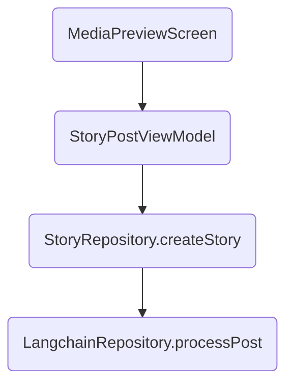

# SnapConnect – AI Caption → Style Detection → RAG Pipeline

> **Purpose**  Document every moving part that produces `ai_caption` and `style_tags` for a story and stores vectors for retrieval-augmented generation (RAG). Use this when debugging or extending the feature set.

---

## 1  Client‐side flow (Android)



| Step | Code | Notes |
|------|------|-------|
| **A** | `MediaPreviewScreen` → `viewModel.postStory(...)` | Triggered when user taps **My Story** |
| **B** | `StoryPostViewModel` forwards params | ─ |
| **C** | `StoryRepository.createStory()` inserts row into `stories` | Immediately after success it calls backend |
| **D** | `LangchainRepository.processPost(userId, storyId, caption, tags)` | `tags` currently = `["image"]` or `["video"]` |

---

## 2  Backend (FastAPI)

### 2.1 Route handler
```python
# snapconnect-backend/app/api/routes/langchain.py
@router.post("/process-post", response_model=ProcessPostResponse)
async def process_post(req: ProcessPostRequest, ...):
    ai_caption = await langchain_service.generate_caption(
        tags=",".join(req.tags),
        media_type="video" if "video" in req.tags else "image",
    )
    dominant_style = await langchain_service.style_from_text(ai_caption)

    # ─ Store two embeddings (user + AI captions) ─
    for text in (req.caption, ai_caption):
        vec = await embedding_service.generate_text_embedding(text)
        pinecone_service.upsert_embedding(uuid4(), vec, {
            "user_id": req.user_id,
            "tags": req.tags,
            "style_tags": [dominant_style],
            "story_id": req.story_id,
        })

    # ─ Patch Supabase row ─
    httpx.patch(f"{SUPABASE_URL}/rest/v1/stories?id=eq.{req.story_id}", \
               headers=svc_role_headers,
               content=json.dumps({"style_tags": [dominant_style], "ai_caption": ai_caption}))
    return {"ai_caption": ai_caption, "style": dominant_style}
```

### 2.2 `LangChainService`
- **Initialisation** attaches Pinecone depending on SDK version (`2.x` vs `3+`).
```python
if hasattr(pinecone, "init"):
    pinecone.init(api_key=..., environment=...)
    self.vectorstore = LC_Pinecone.from_existing_index(...)
else:
    pc = pinecone.Pinecone(api_key=...)
    index = pc.Index(settings.PINECONE_INDEX_NAME)
    self.vectorstore = LC_Pinecone(index, self.embeddings, "text")
```
- **Caption generation**
```python
prompt = ("You are a creative assistant. "
          f"Write a concise, vivid {media_type} description in 20 words or fewer.\n"
          f"Tags: {tags}")
return self.llm.predict(prompt)
```
- **Style detection** (vector similarity against `style-taxonomy` namespace)
```python
vec = self.embeddings.embed_query(text)
matches = self.vectorstore.similarity_search_by_vector(vec, k=1,
                namespace="style-taxonomy")
return matches[0].metadata.get("style_name", "unknown") if matches else "unknown"
```

### 2.3 `PineconeService`
Initialises or creates the index lazily, handles `upsert` and `search_similar`.
Supports both serverless & classic indexes.

---

## 3  Data written

### Supabase `stories` row
| column | source |
|--------|--------|
| `ai_caption` | LLM output |
| `style_tags` | [`dominant_style`] |
| `is_public` | From Android toggle |
| `viewer_ids` | Managed client-side |

### Pinecone namespace `community-assets`
```
(id, vector, metadata={
  "user_id": "…",
  "tags": ["image"],
  "style_tags": ["pop-art"],
  "story_id": "…"
})
```

### Pinecone namespace `style-taxonomy`
Pre-seeded with style label vectors; queried to map caption → style.

---

## 4  Environment variables
```
OPENAI_API_KEY
PINECONE_API_KEY
PINECONE_INDEX_NAME=snapconnect
PINECONE_ENVIRONMENT=us-east-1-aws
SUPABASE_URL
SUPABASE_SERVICE_ROLE_KEY
```

---

## 5  Common failure points & fixes
| Symptom | Likely cause | Fix |
|---------|--------------|----|
| `Pinecone module not available` | SDK missing in image | ensure `pinecone-client==2.2.4` in both requirements |
| *Failed to resolve controller…* | Wrong `PINECONE_ENVIRONMENT` | set exactly `us-east-1-aws` |
| `style_from_text → unknown` | vectorstore is `None` or style namespace empty | check Pinecone init & that `style-taxonomy` vectors exist |
| Every caption mentions "sunset" | Only tag passed is `image` | send richer tags after vision model or skip auto-caption |

---

## 6  Next steps / TODO
1. Add vision tagging (CLIP or GPT-4o vision) → supply meaningful tags.
2. Re-enable `/embed/image` route and remove the 501 stub.
3. Consider moving caption prompt into configurable template.
4. Cache Pinecone client between requests (depends on deployment model).

---

*Document generated automatically — keep in sync when pipeline changes.* 